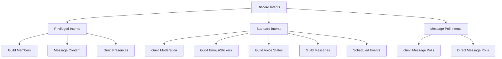

import { Aside } from '@astrojs/starlight/components';

Gateway Intents are filters that determine which events and data your bot receives from Discord. Properly configuring intents optimizes performance and ensures your bot has access to the data it needs.

## What are Gateway Intents?

Intents allow you to specify which Discord events your bot should receive. By selecting specific intents, you can:

1. **Reduce data transfer** - Only receive events you need
2. **Optimize performance** - Less data means faster processing
3. **Comply with Discord** - Some data requires explicit permission

## Intent Categories

Discord intents fall into three categories:

### Standard Intents

Available to all bots without special permission:

- Guild Moderation
- Guild Emojis and Stickers
- Guild Webhooks
- Guild Invites
- Guild Voice States
- Guild Messages
- Guild Message Reactions
- Guild Message Typing
- Direct Messages
- Direct Message Reactions
- Direct Message Typing
- Scheduled Events

### Privileged Intents

Require explicit enabling in the Discord Developer Portal:

- **Guild Members** - Access to member join/leave events and member lists
- **Message Content** - Access to message content (required for reading messages!)
- **Guild Presences** - Access to member presence/status information

<Aside type="caution" title="Verification Required">
  Bots in **100+ servers** must go through Discord verification to use privileged intents. Plan ahead if you expect rapid growth!
</Aside>

### Message Poll Intents

For handling poll-related events:

- Guild Message Polls
- Direct Message Polls

## Enabling Privileged Intents

To use privileged intents:

1. Go to [Discord Developer Portal](https://discord.com/developers/applications)
2. Select your application
3. Navigate to the "Bot" section
4. Scroll to "Privileged Gateway Intents"
5. Enable the intents you need
6. Save changes

<Aside type="danger" title="Required for Most Bots">
  Without the **Message Content** intent, your bot **cannot read message content** in most situations. Make sure to enable it!
</Aside>

## Using Intents in DiSky

### Default Intents

For most bots, use `default intents`:

```applescript
define new bot named "MyBot":
    token: "YOUR_TOKEN"
    intents: default intents
```

Default intents include:
- Guild messages
- Direct messages
- Guild message reactions
- Guild voice states
- And other common intents

### Specific Intents

Specify exactly which intents you need:

```applescript
define new bot named "MyBot":
    token: "YOUR_TOKEN"
    intents: guild members, message content, guild messages
```

### All Intents

Enable all available intents:

```applescript
define new bot named "MyBot":
    token: "YOUR_TOKEN"
    intents: all intents
```

<Aside type="caution">
  Using all intents uses more bandwidth and memory. Only enable what you need.
</Aside>

### Combining Intents

You can combine multiple intents:

```applescript
define new bot named "MyBot":
    token: "YOUR_TOKEN"
    intents: default intents, guild members, message content, guild presences
```

## Common Intent Combinations

### Basic Message Bot

```applescript
intents: guild messages, message content
```

### Member Management Bot

```applescript
intents: guild members, guild messages, message content
```

### Voice-Enabled Bot

```applescript
intents: default intents, guild voice states
```

### Full-Featured Bot

```applescript
intents: all intents
```

## Intent Requirements

Some DiSky features require specific intents:

| Feature | Required Intent |
|---------|----------------|
| Read message content | Message Content (privileged) |
| Access member list | Guild Members (privileged) |
| Member join/leave events | Guild Members (privileged) |
| Member status/presence | Guild Presences (privileged) |
| Voice state updates | Guild Voice States |
| Emoji/sticker updates | Guild Emojis and Stickers |
| Scheduled events | Scheduled Events |

## Best Practices

1. **Start with default intents** - Good for most bots
2. **Add privileged intents as needed** - Enable in Developer Portal first
3. **Don't use all intents unnecessarily** - Only enable what you need
4. **Plan for growth** - Consider verification requirements for 100+ servers
5. **Test thoroughly** - Ensure your bot has all required intents

## Troubleshooting

### "CloseCode 4014" or "Disallowed intents" Error

This means you're using intents in code that aren't enabled in the Developer Portal.

**Solution**: Enable the required privileged intents in the Discord Developer Portal.

### Bot Can't Read Messages

You're missing the **Message Content** intent.

**Solution**:
1. Enable it in the Developer Portal
2. Add it to your bot configuration:
   ```applescript
   intents: default intents, message content
   ```

### Member Events Not Firing

You're missing the **Guild Members** intent.

**Solution**:
1. Enable it in the Developer Portal
2. Add it to your bot configuration:
   ```applescript
   intents: default intents, guild members
   ```

## Example Configurations

### Minimal Bot (Commands Only)

```applescript
define new bot named "MyBot":
    token: "YOUR_TOKEN"
    intents: guild messages
    policy: none
    cache flags: none
```

### Standard Bot (Messages + Members)

```applescript
define new bot named "MyBot":
    token: "YOUR_TOKEN"
    intents: default intents, guild members, message content
    policy: all
    cache flags: default cache
```

### Advanced Bot (Full Features)

```applescript
define new bot named "MyBot":
    token: "YOUR_TOKEN"
    intents: all intents
    policy: all
    cache flags: all
```

## Visual Guide



<Aside type="tip">
  When in doubt, start with `default intents` and add privileged intents as needed. Most bots work great with this approach!
</Aside>

## Next Steps

- Configure [Cache Policy & Flags](/basics/cache-policy/)
- Learn about [Bot Configuration](/basics/bot-configuration/)
- Set up [Multiple Bots](/basics/multiple-bots/)
